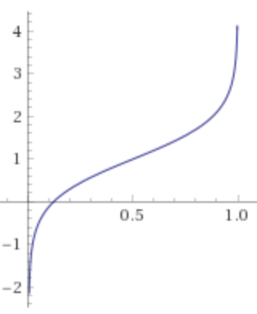

# fees

The `fees` module provides functionality for handling transaction fee related operations. 

* [Module Logic and Usage](#annot8)
* [Historic Examples of Economic Attacks](#attacks)

When developing with Substrate, it is **extremely important** that the *price paid* for an operation is greater than or equal to the *resources utilized*. If this variant is not upheld, the blockchain may panic and stop. Moreover, this situation may shift storage irreversibly even in the absence of transaction finality.

Likewise, economic security requires a robust in-module fee structure. The best way to safeguard against economic attacks is to follow the [`Verify First, Write Last`](https://shawntabrizi.github.io/substrate-collectables-workshop/#/2/tracking-all-kitties?id=quotverify-first-write-lastquot) paradigm introduced in the Substrate Cryptokitties Collectables tutorial. 

> This style of programming is also known as [Declarative Smart Contracts](https://www.tokendaily.co/blog/declarative-smart-contracts) and [Condition-Oriented Programming (COP)](https://www.parity.io/condition-oriented-programming/).

Economic security audits will start with a review of the implementation of the traits in this module, thereby necessitating close attention to its logic. After going through the code, we'll discuss patterns for use in other modules.

## Module Logic <a name = "annot8"></a>

Let's start with storage. The module requires implementations of the module's Trait to specify a `transaction_base_fee` and `transaction_byte_fee` upon configuration.

```rust
decl_storage! {
	trait Store for Module<T: Trait> as Fees {
		/// The fee to be paid for making a transaction; the base.
		pub TransactionBaseFee get(transaction_base_fee) config(): AssetOf<T>;
		/// The fee to be paid for making a transaction; the per-byte portion.
		pub TransactionByteFee get(transaction_byte_fee) config(): AssetOf<T>;

		/// The `extrinsic_index => accumulated_fees` map, containing records to
		/// track the overall charged fees for each transaction.
		///
		/// All records should be removed at finalise stage.
		CurrentTransactionFee get(current_transaction_fee): map u32 => AssetOf<T>;
	}
}
```

In Substrate, transaction finality does not always guarantee successful execution of functions dependent on the given transaction. For this reason, it is important to use an event to verify successful execution at the bottom of a function (after all the conditions are checked with the *Verify First, Write Last* pattern). 

```rust
decl_event!(
	pub enum Event<T> where Amount = AssetOf<T> {
		/// Fee charged (extrinsic_index, fee_amount)
		Charged(u32, Amount),
	}
);
```

Now, our module declaration should make sense:

```rust
decl_module! {
	pub struct Module<T: Trait> for enum Call where origin: T::Origin {
		fn deposit_event<T>() = default;

		fn on_finalise() {
			let extrinsic_count = <system::Module<T>>::extrinsic_count();
			(0..extrinsic_count).for_each(|index| {
				// Deposit `Charged` event if some amount of fee charged.
				let fee = <CurrentTransactionFee<T>>::take(index);
				if !fee.is_zero() {
					Self::deposit_event(RawEvent::Charged(index, fee));
				}
			});
		}
	}
}
```

Are you happy?! Ha, neither am I. 

We still haven't even covered how the required config values `transaction_base_fee` and `transaction_byte_fee` (specified in `decl_storage`) would be used to set any transaction fees. Indeed, we have not really revealed what `<CurrentTransactionFee<T>>::take(index)` is doing behind the scenes.

The only code left in `Module<T>` other than the import staments is the two `impl` blocks that specify the implementations for `ChargeBytesFee<T::AccountId> ` and `ChargeFee<T::AccountId>`. The `impl<T: Trait> ChargeFee<T::AccountId>` contains greater functionality with a `refund_fee` method so we'll look here for the answers to our questions.

```rust
/// inside `impl<T: Trait> ChargeFee<T::AccountId> for Module<T> {} `
type Amount = AssetOf<T>;

fn charge_fee(transactor: &T::AccountId, amount: AssetOf<T>) -> Result {
    let extrinsic_index = <system::Module<T>>::extrinsic_index().ok_or_else(|| "no extrinsic index found")?;
    let current_fee = Self::current_transaction_fee(extrinsic_index);
    let new_fee = current_fee.checked_add(&amount).ok_or_else(|| "fee got overflow after charge")?;

    T::TransferAsset::withdraw(transactor, amount, WithdrawReason::TransactionPayment)?;

    <CurrentTransactionFee<T>>::insert(extrinsic_index, new_fee);
    Ok(())
}

fn refund_fee(transactor: &T::AccountId, amount: AssetOf<T>) -> Result {
    let extrinsic_index = <system::Module<T>>::extrinsic_index().ok_or_else(|| "no extrinsic index found")?;
    let current_fee = Self::current_transaction_fee(extrinsic_index);
    let new_fee = current_fee.checked_sub(&amount).ok_or_else(|| "fee got underflow after refund")?;

    T::TransferAsset::deposit(transactor, amount)?;

    <CurrentTransactionFee<T>>::insert(extrinsic_index, new_fee);
    Ok(())
}
```

In this implementation, it is clear that the `type Amount = AssetOf<T>;` decides how large the transaction fee as well as the transaction refund. 

Now let's see if we can get creative. What if want to alternate the fee according to network congestion similar to [Vitalik's most recent proposal to fix the Etherem gas market](https://medium.com/@eric.conner/fixing-the-ethereum-fee-market-eip-1559-9109f1c1814b)? Alternate the fee based on the used space for all contracts. Although there is not currently a parameter for measuring the capacity of contract storage, smart contract platforms may introduce this value as part of the global state. For the purposes of our example, we'll claim that `CURRENT_RELATIVE_CAPACITY` varies from 0 to 1. We want to increase fees when `CURRENT_RELATIVE_CAPACITY > 0.5` and decrease fees when `CURRENT_RELATIVE_CAPACITY < 0.5`.

```rust
impl<T: Trait> AlternateFee<T::AccountId> for Module<T> {
    type BASE_FEE = AssetOf<T>;

    fn charge_fee(transactor: &T::AccountId, base_fee: AssetOf<T>) -> Result {
        let extrinsic_index = <system::Module<T>>::extrinsic_index().ok_or_else(|| "no extrinsic index found")?;
        let current_fee = Self::current_transaction_fee(extrinsic_index);
        let marginal_fee = &base_fee.check_mult(CURRENT_RELATIVE_CAPACITY)
        let new_fee = current_fee.checked_add(&marginal_fee).ok_or_else(|| "fee got overflow after charge")?;

        T::TransferAsset::withdraw(transactor, amount, WithdrawReason::TransactionPayment)?;

        <CurrentTransactionFee<T>>::insert(extrinsic_index, new_fee);
        Ok(())
    }
}
```

In this simple implementation, the transaction fee increases linearly with the `CURRENT_RELATIVE_CAPACITY`. This parameterization assumes `0.5 * BASE_FEE` as the transaction fee for utilization of 50% of the space designated for smart contracts. 

By subtly changing how the transaction fee scales with `CURRENT_RELATIVE_CAPACITY`, it is not difficult to incentivize a soft bound between 25% and 75% capacity utilization before exponentially ramping up transaction fees. For the purposes of our example, we can use a parameterized [logit function](https://tinyurl.com/y35rrrvp) to formalize this incentive structure.



Once the function becomes negative, we will offer no transaction fees to incentivize activity on the network (*note*: this may violate economic security and should be viewed as an example rather than a recommendation). To isolate the code used in our formula, write [macros](https://danielkeep.github.io/tlborm/book/index.html) and test them in a different file.

```rust
macro_rules! log_of {
    ($val:expr, $base:expr, $type:ty) => {
         ($val as f32).log($base) as $type
    }
}

macro_rules! special_logit {
    ($val:expr, $type:ty) => {
        ((log_of!(val, 10., usize) - log_of(1- val, 10., usize)).checked_add(2)).checked_mult(0.5)as $type
    }
}
```

If we placed our macros in our module, we can finish our implementation

```rust
impl<T: Trait> AlternateFee<T::AccountId> for Module<T> {
    type BASE_FEE = AssetOf<T>;

    fn charge_fee(transactor: &T::AccountId, base_fee: AssetOf<T>) -> Result {
        let extrinsic_index = <system::Module<T>>::extrinsic_index().ok_or_else(|| "no extrinsic index found")?;
        let current_fee = Self::current_transaction_fee(extrinsic_index);

        let marginal_fee = special_logit!(&base_fee);
        if marginal_fee <= 0 {
            // no transaction fee charged
            return Ok(());
        } else {
            let new_fee = current_fee.checked_add(&marginal_fee).ok_or_else(|| "fee got overflow after charge")?;

            T::TransferAsset::withdraw(transactor, marginal_fee, WithdrawReason::TransactionPayment)?;

            <CurrentTransactionFee<T>>::insert(extrinsic_index, new_fee);
            Ok(())
        }
    }
}
```

## Historic Examples of Economic Attacks <a name = "attacks"></a>

In September of 2016, a flaw in the EVM's protocol for setting gas prices was exploited to construct transactions that ate up a lot of resources without requiring an appropriate cost from the transaction submitter. This attack on the Ethereum blockchain caused many implementations to crash on block number 2,283,416, but Parity continued to run. In [Onwards](https://www.parity.io/onwards/), Gavin Wood attributed Parity's ability to overcome the attack to "great optimization and profiling efforts, a clean codebase written for efficiency and robustness from the ground up and the use of the extremely lean Rust language." 