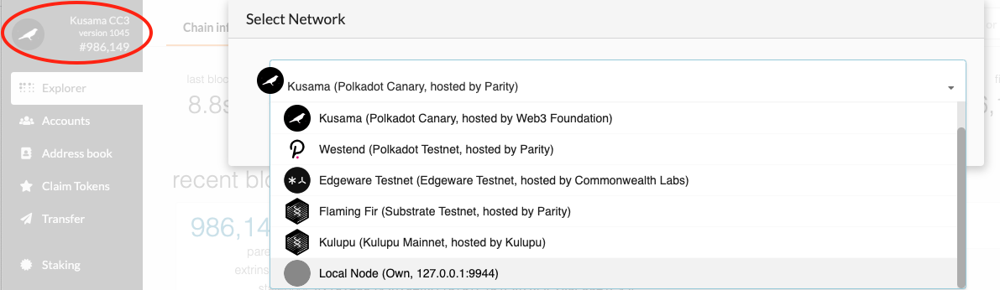

# Interact with the Kitchen Node

If you followed the instructions to [build the node](./1-build-node.md), you my proceed to launch
your first blockchain.

## Launch a Development Node

Before we launch our node we will purge any chain data. If you've followed the instructions exactly,
you will not yet have any chain data to purge, but on each subsequent run, you will, and it is best
to get in the habit of purging your chain now. We will start our node in development mode (`--dev`).

```bash
# Purge existing blockchain data (if any)
./target/release/kitchen-node purge-chain --dev

# Start a fresh development blockchain
./target/release/kitchen-node --dev
```

You should now see your node up and running and waiting for transactions. This Kitchen Node, and
several other nodes included with the Recipes, is an instant seal node. That means it will not
create any blocks until there are transactions to process. It also means that when a transaction is
ready, the node will instantly create a block. Instant seal nodes are ideal for experimenting with
your Substrate runtime. The output looks something like this.

```
2020-05-18 14:33:35 Running in --dev mode, RPC CORS has been disabled.
2020-05-18 14:33:35 Kitchen Node
2020-05-18 14:33:35 ✌️  version 2.0.0-alpha.7-6f91ef9-x86_64-linux-gnu
2020-05-18 14:33:35 ❤️  by Joshy Orndorff:4meta5:Jimmy Chu, 2019-2020
2020-05-18 14:33:35 📋 Chain specification: Development
2020-05-18 14:33:35 🏷  Node name: confused-songs-1348
2020-05-18 14:33:35 👤 Role: AUTHORITY
2020-05-18 14:33:35 💾 Database: RocksDb at /home/joshy/.local/share/kitchen-node/chains/dev/db
2020-05-18 14:33:35 ⛓  Native runtime: super-runtime-1 (super-runtime-1.tx1.au1)
2020-05-18 14:33:35 🔨 Initializing Genesis block/state (state: 0x1835…9bd7, header-hash: 0x239e…48d8)
2020-05-18 14:33:35 📦 Highest known block at #0
2020-05-18 14:33:35 Using default protocol ID "sup" because none is configured in the chain specs
2020-05-18 14:33:35 🏷  Local node identity is: QmQXnCTyCAfe3QAs43ggyJyWAJ1MoKzqizK991ZRTNQhxi
2020-05-18 14:33:35 〽️ Prometheus server started at 127.0.0.1:9615
2020-05-18 14:33:40 💤 Idle (0 peers), best: #0 (0x239e…48d8), finalized #0 (0x239e…48d8), ⬇ 0 ⬆ 0
```

## Launch the Apps User Interface

You can navigate to the
[Polkadot-JS Apps](https://polkadot.js.org/apps/#/settings/developer?rpc=ws://127.0.0.1:9944) user
interface. This is a general purpose interface for interacting with many different Substrate-based
blockchains including Polkadot. From now on we'll call it "Apps" for short. Before Apps will work
with our blockchain, we need to give it some chain-specific information known as the "types". You'll
learn what all this means as you work through the recipes; for now just follow the instructions.

> If you are not clicking the link above but visiting Apps directly, by default Apps connects to the
> Kusama network. You will need to switch to your locally running network, with only one node, by
> clicking on the network icon on Apps top left corner.
>
> 

> Some browsers, notably Firefox, will not connect to a local node from an https website. An easy
> work around is to try another browser, like Chromium. Another option is to
> [host this interface locally](https://github.com/polkadot-js/apps#development).

If you're not already on the `Settings -> Developer`page, please navigate there. Copy the contents
of `runtimes/super-runtime/types.json` into Apps.


The kitchen node uses the `super-runtime` by default. As you work through the recipes, you'll learn
that it is easy to use other runtimes in this node, or use other nodes entirely. When you do use
another runtime, you need to insert the appropriate types from the
`runtimes/<whatever runtime you're using>/types.json` file. Every runtime that ships with the
Recipes has this file.

## Submitting a Transaction

You may now submit a simple token transfer transaction using the "Transfer" tab. When you do, you
will notice that your node instantly creates a block, and the transaction is processed. As you work
through the recipes, you will use the **Chain State** tab to query the blockchain status and
**Extrinsics** to send transactions to the blockchain. Play around for a bit before moving on.
