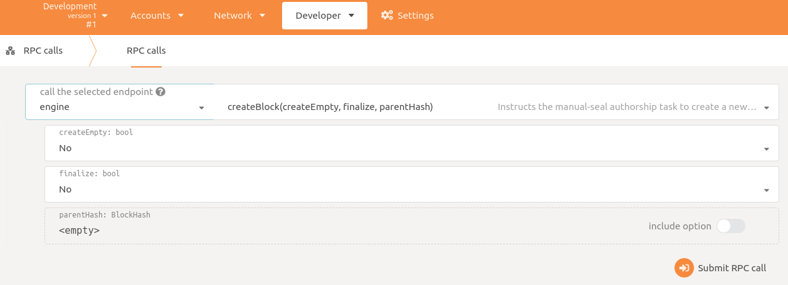

# Custom RPCs

`nodes/custom-rpc`
<a target="_blank" href="https://playground.substrate.dev/?deploy=recipes&files=%2Fhome%2Fsubstrate%2Fworkspace%2Fnodes%2Frpc-node%2Fsrc%2Fsilly_rpc.rs">
	
</a>
<a target="_blank" href="https://github.com/substrate-developer-hub/recipes/tree/master/nodes/rpc-node/src/silly_rpc.rs">
	
</a>

`runtimes/api-runtime`
<a target="_blank" href="https://playground.substrate.dev/?deploy=recipes&files=%2Fhome%2Fsubstrate%2Fworkspace%2Fruntimes%2Fapi-runtime%2Fsrc%2Flib.rs">
	
</a>
<a target="_blank" href="https://github.com/substrate-developer-hub/recipes/tree/master/runtimes/api-runtime/src/lib.rs">
	
</a>

Remote Procedure Calls, or RPCs, are a way for an external program (eg. a frontend) to communicate
with a Substrate node. They are used for checking storage values, submitting transactions, and
querying the current consensus authorities. Substrate comes with several
[default RPCs](https://polkadot.js.org/docs/substrate/rpc). In many cases it is useful to add
custom RPCs to your node. In this recipe, we will add three custom RPCs to our node. The first is trivial, the second calls into a [custom runtime API](./runtime-api.md), and the third interfaces with consensus.

## The RPC Extensions Builder

In order to connect custom RPCs you must provide a function known as an "RPC extension builder". This function takes a parameter for whether the node should deny unsafe RPC calls, and returns an [IoHandler](https://docs.rs/jsonrpc-core/15.0.0/jsonrpc_core/struct.IoHandler.html) that the node needs to create a json RPC. For context, read more at [`RpcExtensionBuilder` trait API doc](https://substrate.dev/rustdocs/v3.0.0/sc_service/trait.RpcExtensionBuilder.html).

```rust, ignore
let rpc_extensions_builder = {
	let client = client.clone();
	let pool = transaction_pool.clone();
	Box::new(move |deny_unsafe, _| {
		let deps = crate::rpc::FullDeps {
			client: client.clone(),
			pool: pool.clone(),
			deny_unsafe,
			command_sink: command_sink.clone(),
		};

		crate::rpc::create_full(deps)
	})
};
```

This code is mostly boilerplate and can be reused. The one difference that you will encounter in your own node is the parameters that you pass. Here we've passed four parameters:

* `client` - will be used in our second RPC
* The transaction `pool` - we will not actually use it but many RPCs do
* `deny_unsafe` - whether to deny unsafe calls
* `commands_sink` - will be used in our third RPC

With this builder function out of the way we can begin attaching our actual RPC endpoints.

## The Silly RPC

We'll begin by defining a simple RPC called "silly rpc" which just returns integers. A Hello world of sorts.

### Defining the Silly RPC

Every RPC that the node will use must be defined in a trait. In the
`nodes/rpc-node/src/silly_rpc.rs` file, we define a basic rpc as

```rust
#[rpc]
pub trait SillyRpc {
	#[rpc(name = "silly_seven")]
	fn silly_7(&self) -> Result<u64>;

	#[rpc(name = "silly_double")]
	fn silly_double(&self, val: u64) -> Result<u64>;
}
```

This definition defines two RPC methods called `silly_seven` and `silly_double`. Each RPC method must
take a `&self` reference and must return a `Result`. Next, we define a struct that implements this
trait.

```rust
pub struct Silly;

impl SillyRpc for Silly {
	fn silly_7(&self) -> Result<u64> {
		Ok(7)
	}

	fn silly_double(&self, val: u64) -> Result<u64> {
		Ok(2 * val)
	}
}
```

Finally, to make the contents of this new file usable, we need to add a line in our `main.rs`.

```rust
mod silly_rpc;
```

### Including the Silly RPC

With our RPC written, we're ready to extend our `IoHandler` with it. We begin with a few dependencies in our
`rpc-node`'s `Cargo.toml`.

```toml
jsonrpc-core = "15.0"
jsonrpc-core-client = "15.0"
jsonrpc-derive = "15.0"
sc-rpc = '3.0'
```

Now we're ready to write the `create_full` function we referenced from our service. The function is quoted in its entirety below. This code is taken from `nodes/rpc-node/src/rpc.rs`.

```rust, ignore
pub fn create_full<C, P>(
	deps: FullDeps<C, P>,
) -> jsonrpc_core::IoHandler<sc_rpc::Metadata> where
	// --snip--
{

	let mut io = jsonrpc_core::IoHandler::default();

	// Add a silly RPC that returns constant values
	io.extend_with(crate::silly_rpc::SillyRpc::to_delegate(
		crate::silly_rpc::Silly {},
	));

	// --snip--

	io
}
```

These few lines extend our node with the Silly RPC.

### Calling the Silly RPC

Once your node is running, you can test the RPC by calling it with any client that speaks json RPC.
One widely available option is `curl`.

```bash
$ curl http://localhost:9933 -H "Content-Type:application/json;charset=utf-8" -d   '{
     "jsonrpc":"2.0",
      "id":1,
      "method":"silly_seven",
      "params": []
    }'
```

To which the RPC responds

```
{"jsonrpc":"2.0","result":7,"id":1}
```

You may have noticed that our second RPC takes a parameter, the value to double. You can supply this
parameter by including its in the `params` list. For example:

```bash
$ curl http://localhost:9933 -H "Content-Type:application/json;charset=utf-8" -d   '{
     "jsonrpc":"2.0",
      "id":1,
      "method":"silly_double",
      "params": [7]
    }'
```

To which the RPC responds with the doubled parameter

```
{"jsonrpc":"2.0","result":14,"id":1}
```

## RPC to Call a Runtime API

The silly RPC demonstrates the fundamentals of working with RPCs in Substrate. Nonetheless, most
RPCs will go beyond what we've learned so far and actually interacts with other parts of the node.
In this second example, we will include an RPC that calls into the `sum-storage` runtime API from
the [runtime API recipe](./runtime-api.md). While it isn't strictly necessary to understand what the
runtime API does, reading that recipe may provide helpful context.

### Defining the Sum Storage RPC

Because this RPC's behavior is closely related to a specific pallet, we've chosen to define the RPC
in the pallet's directory. In this case the RPC is defined in `pallets/sum-storage/rpc`. So rather
than using the `mod` keyword as we did before, we must include this RPC definition in the node's
`Cargo.toml` file.

```toml
sum-storage-rpc = { path = "../../pallets/sum-storage/rpc" }
```

Defining the RPC interface is similar to before, but there are a few differences worth noting.
First, the struct that implements the RPC needs a reference to the `client`. This is necessary so we
can actually call into the runtime. Second the struct is generic over the `BlockHash` type. This is
because it will call a runtime API, and runtime APIs must always be called at a specific block.

```rust
#[rpc]
pub trait SumStorageApi<BlockHash> {
	#[rpc(name = "sumStorage_getSum")]
	fn get_sum(
		&self,
		at: Option<BlockHash>
	) -> Result<u32>;
}

/// A struct that implements the `SumStorageApi`.
pub struct SumStorage<C, M> {
	client: Arc<C>,
	_marker: std::marker::PhantomData<M>,
}

impl<C, M> SumStorage<C, M> {
	/// Create new `SumStorage` instance with the given reference to the client.
	pub fn new(client: Arc<C>) -> Self {
		Self { client, _marker: Default::default() }
	}
}
```

The RPC's implementation is also similar to before. The additional syntax here is related to calling
the runtime at a specific block, as well as ensuring that the runtime we're calling actually has the
correct runtime API available.

```rust
impl<C, Block> SumStorageApi<<Block as BlockT>::Hash>
	for SumStorage<C, Block>
where
	Block: BlockT,
	C: Send + Sync + 'static,
	C: ProvideRuntimeApi,
	C: HeaderBackend<Block>,
	C::Api: SumStorageRuntimeApi<Block>,
{
	fn get_sum(
		&self,
		at: Option<<Block as BlockT>::Hash>
	) -> Result<u32> {

		let api = self.client.runtime_api();
		let at = BlockId::hash(at.unwrap_or_else(||
			// If the block hash is not supplied assume the best block.
			self.client.info().best_hash
		));

		let runtime_api_result = api.get_sum(&at);
		runtime_api_result.map_err(|e| RpcError {
			code: ErrorCode::ServerError(9876), // No real reason for this value
			message: "Something wrong".into(),
			data: Some(format!("{:?}", e).into()),
		})
	}
}
```

### Installing the Sum Storage RPC

To install this RPC , we expand the existing `create_full` function from `rpc.rs`.

```rust
io.extend_with(sum_storage_rpc::SumStorageApi::to_delegate(
	sum_storage_rpc::SumStorage::new(client),
));
```

### Using RPC Parameters

This RPC takes a parameter ,`at`, whose type is `Option<_>`. We may call this RPC by omitting the
optional parameter entirely. In this case the implementation provides a default value of the best
block.

```bash
$ curl http://localhost:9933 -H "Content-Type:application/json;charset=utf-8" -d   '{
     "jsonrpc":"2.0",
      "id":1,
      "method":"sumStorage_getSum",
      "params": []
    }'
```

We may also call the RPC by providing a block hash. One easy way to get a block hash to test this
call is by copying it from the logs of a running node.

```bash
$ curl http://localhost:9933 -H "Content-Type:application/json;charset=utf-8" -d   '{
     "jsonrpc":"2.0",
      "id":1,
      "method":"sumStorage_getSum",
      "params": ["0x87b2e4b93e74d2f06a0bde8de78c9e2a9823ce559eb5e3c4710de40a1c1071ac"]
    }'
```

As an exercise, change the storage values and confirm that the RPC provides the correct updated sum.
Then call the RPC at an old block and confirm you get the old sum.

### Polkadot JS API

Many frontends interact with Substrate nodes through Polkadot JS API. While the Recipes does not
strive to document that project, we have included a snippet of javascript for interacting with these first two
custom RPCs in the `nodes/rpc-node/js` directory.

## The Manual Seal RPC

Our third and final example RPC will interact with consensus. Specifically, it will tell the consensus engine when to author and finalize blocks. The API for this RPC if defined in Substrate in the [`ManualSealApi` Trait](https://substrate.dev/rustdocs/v3.0.0/sc_consensus_manual_seal/rpc/trait.ManualSealApi.html).

### Installing the Manual Seal RPC

The previous RPC needed a reference to the `client` to call into the runtime. Likewise, this RPC needs a command stream to send messages to the actual consensus engine. This recipe does not cover installing the manual seal engine, but it is nearly identical to the [instant seal engine](https://substrate.dev/rustdocs/v3.0.0/sc_consensus_manual_seal/fn.run_instant_seal.html) used in the [Kitchen Node](./kitchen-node.md).

To install the RPC endpoint, we do exactly as we have before, and extend the `create_full` function in `rpc.rs`

```rust, ignore
io.extend_with(
	// We provide the rpc handler with the sending end of the channel to allow the rpc
	// send EngineCommands to the background block authorship task.
	ManualSealApi::to_delegate(ManualSeal::new(command_sink)),
);
```

### Using Manual Seal

Once your node is running, you will see that it just sits there idly. It will accept transactions to
the pool, but it will not author blocks on its own. In manual seal, the node does not author a block
until we explicitly tell it to. We can tell it to author a block by calling the `engine_createBlock`
RPC.

The easiest way is to use Apps's Developer -> RPC Calls tab.



It can also be called using `curl` as described previously.

```bash
$ curl http://localhost:9933 -H "Content-Type:application/json;charset=utf-8" -d   '{
     "jsonrpc":"2.0",
      "id":1,
      "method":"engine_createBlock",
      "params": [true, false, null]
    }'
```

This call takes three parameters, each of which are worth exploring.

#### Create Empty

`create_empty` is a Boolean value indicating whether empty blocks may be created. Setting
`create-empty` to true does not mean that an empty block will necessarily be created. Rather it
means that the engine should go ahead creating a block even if no transaction are present. If
transactions are present in the queue, they will be included regardless of `create_empty`'s value.'

#### Finalize

`finalize` is a Boolean indicating whether the block (and its ancestors, recursively) should be
finalized after creation. Manually controlling finality is interesting, but also dangerous. If you
attempt to author and finalize a block that does not build on the best finalized chain, the block
will not be imported. If you finalize one block in one node, and a conflicting block in another
node, you will cause a safety violation when the nodes synchronize.

#### Parent Hash

`parent_hash` is an optional hash of a block to use as a parent. To set the parent, use the format
`"0x0e0626477621754200486f323e3858cd5f28fcbe52c69b2581aecb622e384764"`. To omit the parent, use
`null`. When the parent is omitted the block is built on the current best block. Manually specifying
the parent is useful for constructing fork scenarios and demonstrating chain reorganizations.

#### Manually Finalizing Blocks

In addition to finalizing blocks while creating them, they can be finalized later by using the
second provided RPC call, `engine_finalizeBlock`.

```bash
$ curl http://localhost:9933 -H "Content-Type:application/json;charset=utf-8" -d   '{
     "jsonrpc":"2.0",
      "id":1,
      "method":"engine_finalizeBlock",
      "params": ["0x0e0626477621754200486f323e3858cd5f28fcbe52c69b2581aecb622e384764", null]
    }'
```

The two parameters are:

-   The hash of the block to finalize.
-   A Justification. TODO what is the justification and why might I want to use it?
